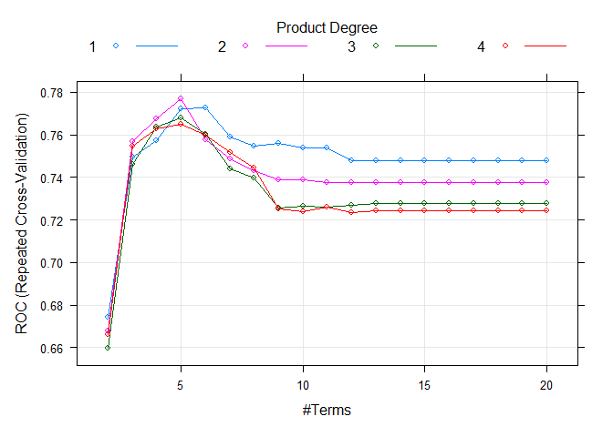
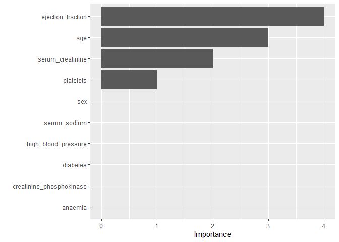

Report
================
Xuehan Yang
2022/3/24

``` r
library(tidyverse)
library(caret)
library(pROC)
library(pdp)
library(vip)
library(AppliedPredictiveModeling)
```

# Introduction

Heart failure is a common form of cardiovascular disease, which is a
severe threat to patient’s life. It occurs when the heart muscle doesn’t
pump blood as well as it should. Our research aims predict the death
probability among heart failure patients with machine learning models on
clinical features.

# Data

``` r
hf_df <- read_csv("heart_failure_clinical_records_dataset.csv") %>% janitor::clean_names() %>% mutate(
  death_event = case_when(
    death_event == 1 ~ "Y",
    death_event == 0 ~ "N"
  ),
  death_event = factor(death_event)
) %>% select(-time)
```

The dataset we analyzed contains the medical records of 299 heart
failure patients collected at the Faisalabad Institute of Cardiology and
at the Allied Hospital in Faisalabad (Punjab, Pakistan), during
April–December 2015 <sup>1</sup> <sup>2</sup>. It is a prospective
cohort study. The patients consisted of 105 women and 194 men, and their
ages range between 40 and 95 years old. The features of those patients
include 12, which further will become our predictors.

# Exploratory analysis/visualization

## Continuous predictors

``` r
featurePlot(x = hf_df[,c(1,3,5,7,8,9)],
            y = hf_df$death_event,
            scales = list(x = list(relation = "free"),
                          y = list(relation = "free")),
            plot = "density", pch = "l",
            auto.key = list(columns = 2))
```

<!-- -->

Among all the continuous predictors, we can see that death events
grouped when the follow-up-period is short(time &lt; 50), patients with
higher level of serum sodium tended to have death event, and patients
with lower ejection fraction tended to have death event.

## Binary predictors

``` r
contin_tb <- 
hf_df %>% select(anaemia, diabetes, high_blood_pressure, sex, smoking, death_event) %>% 
  pivot_longer(
    cols = 1:5,
    names_to = "feature",
    values_to = "exposed"
  ) %>% 
  group_by(feature, exposed, death_event) %>% 
  summarise(n = n()) %>% 
  pivot_wider(
    names_from = death_event,
    values_from = n
  )

contin_tb %>% knitr::kable()
```

| feature               | exposed |   N |   Y |
|:----------------------|--------:|----:|----:|
| anaemia               |       0 | 120 |  50 |
| anaemia               |       1 |  83 |  46 |
| diabetes              |       0 | 118 |  56 |
| diabetes              |       1 |  85 |  40 |
| high\_blood\_pressure |       0 | 137 |  57 |
| high\_blood\_pressure |       1 |  66 |  39 |
| sex                   |       0 |  71 |  34 |
| sex                   |       1 | 132 |  62 |
| smoking               |       0 | 137 |  66 |
| smoking               |       1 |  66 |  30 |

``` r
contin_tb %>% mutate(risk = Y/N) %>% 
  select(-N,-Y) %>% 
  mutate(
    exposed = case_when(
      exposed == 1 ~ "exposed",
      exposed == 0 ~ "nonexposed"
    )
  ) %>% 
  pivot_wider(
    names_from = exposed,
    values_from = risk
  ) %>% 
  mutate(riskratio = exposed/nonexposed) %>% 
  arrange(desc(riskratio)) %>% knitr::kable()
```

| feature               | nonexposed |   exposed | riskratio |
|:----------------------|-----------:|----------:|----------:|
| high\_blood\_pressure |  0.4160584 | 0.5909091 | 1.4202552 |
| anaemia               |  0.4166667 | 0.5542169 | 1.3301205 |
| diabetes              |  0.4745763 | 0.4705882 | 0.9915966 |
| sex                   |  0.4788732 | 0.4696970 | 0.9808378 |
| smoking               |  0.4817518 | 0.4545455 | 0.9435262 |

Among the binary predictors, the risk ratio of high blood pressure and
anaemia are 1.42 and 1.33, which means the risk of death among heart
failure patients with hypertension is 1.42 times the risk of death among
heart failure patients without hypertension, and the risk of death among
heart failure patients with anaemia is 1.33 times the risk of death
among heart failure patients without anaemia.

# Models

In order to decide whether a patient with heart failure would die in
following period, we use classification models to see what kinds of
features correspond to the death event.

## predictor

There are 12 predictors included in our models, consisting of 7
continuous predictors and 5 binary predictors. Specifically, age of the
patient (age), if decrease of red blood cells or hemoglobin (anaemia),
if the patient has hypertension (high\_blood\_pressure), level of the
CPK enzyme in the blood (creatinine\_phosphokinase), if the patient has
diabetes (diabete), percentage of blood leaving the heart at each
contraction (ejection\_fraction), platelets in the blood (platelets),
woman or man (sex), level of serum creatinine in the blood
(serum\_creatinine), level of serum sodium in the blood (serum\_sodium),
if the patient smokes or not (smoking), follow-up period (time), if the
patient deceased during the follow-up period (death\_event).

## Cross Validation splitting

``` r
set.seed(11)
trainrows <- createDataPartition(y = hf_df$death_event,
                                 p = 0.7,
                                 list = FALSE)
```

Full dataset is partitioned to 70% training data and 30% test data.

## Logistic Regression

$$log(\\frac{\\pi\_i}{1-\\pi\_i}) = \\beta\_0 + \\beta\_1x\_1 + \\beta\_2x\_2 + \\cdots + \\beta\_px\_p\\quad p=12$$

``` r
ctrl <- trainControl(method = "repeatedcv", repeats = 5, number = 5,
                     summaryFunction = twoClassSummary,
                     classProbs = TRUE)

set.seed(22)
glm.model <- train(x = hf_df[trainrows, -12],
                   y = hf_df$death_event[trainrows],
                   method = "glm",
                   metric = "ROC",
                   trControl = ctrl)
summary(glm.model)
```

    ## 
    ## Call:
    ## NULL
    ## 
    ## Deviance Residuals: 
    ##     Min       1Q   Median       3Q      Max  
    ## -2.0148  -0.7845  -0.4572   0.8383   2.5394  
    ## 
    ## Coefficients:
    ##                            Estimate Std. Error z value Pr(>|z|)    
    ## (Intercept)               1.108e+01  5.972e+00   1.856 0.063508 .  
    ## age                       5.417e-02  1.526e-02   3.549 0.000387 ***
    ## anaemia                   4.131e-01  3.604e-01   1.146 0.251680    
    ## creatinine_phosphokinase  2.032e-04  1.756e-04   1.157 0.247068    
    ## diabetes                  1.586e-01  3.574e-01   0.444 0.657104    
    ## ejection_fraction        -7.388e-02  1.838e-02  -4.020 5.82e-05 ***
    ## high_blood_pressure       2.933e-01  3.697e-01   0.793 0.427518    
    ## platelets                -5.187e-07  1.931e-06  -0.269 0.788190    
    ## serum_creatinine          3.840e-01  2.323e-01   1.653 0.098321 .  
    ## serum_sodium             -9.751e-02  4.421e-02  -2.205 0.027426 *  
    ## sex                      -3.419e-01  4.234e-01  -0.807 0.419459    
    ## smoking                   1.477e-01  4.216e-01   0.350 0.726029    
    ## ---
    ## Signif. codes:  0 '***' 0.001 '**' 0.01 '*' 0.05 '.' 0.1 ' ' 1
    ## 
    ## (Dispersion parameter for binomial family taken to be 1)
    ## 
    ##     Null deviance: 265.26  on 210  degrees of freedom
    ## Residual deviance: 209.42  on 199  degrees of freedom
    ## AIC: 233.42
    ## 
    ## Number of Fisher Scoring iterations: 5

## Penalized Logistic Regression

``` r
glmnGrid <- expand.grid(.alpha = seq(0, 1, length = 21), .lambda = exp(seq(-5, 2, length = 40)))

set.seed(22)
glmn.model <- train(x = hf_df[trainrows, -12],
                    y = hf_df$death_event[trainrows],
                    method = "glmnet",
                    tuneGrid = glmnGrid,
                    metric = "ROC",
                    trControl = ctrl)
glmn.model$bestTune
```

    ##    alpha    lambda
    ## 68  0.05 0.8574039

``` r
coef(glmn.model$finalModel, glmn.model$bestTune$lambda)
```

    ## 12 x 1 sparse Matrix of class "dgCMatrix"
    ##                                    s1
    ## (Intercept)               1.264575612
    ## age                       0.005744920
    ## anaemia                   .          
    ## creatinine_phosphokinase  .          
    ## diabetes                  .          
    ## ejection_fraction        -0.008682643
    ## high_blood_pressure       .          
    ## platelets                 .          
    ## serum_creatinine          0.062330877
    ## serum_sodium             -0.015565079
    ## sex                       .          
    ## smoking                   .

## Logistic with GAM

``` r
set.seed(22)
gam.model <- train(x = hf_df[trainrows, -12],
                   y = hf_df$death_event[trainrows],
                   method = "gam",
                   metric = "ROC",
                   trControl = ctrl)
gam.model$finalModel
```

    ## 
    ## Family: binomial 
    ## Link function: logit 
    ## 
    ## Formula:
    ## .outcome ~ anaemia + diabetes + high_blood_pressure + sex + smoking + 
    ##     s(ejection_fraction) + s(serum_sodium) + s(serum_creatinine) + 
    ##     s(age) + s(platelets) + s(creatinine_phosphokinase)
    ## 
    ## Estimated degrees of freedom:
    ## 2.107 0.657 3.175 2.355 3.713 0.000  total = 18.01 
    ## 
    ## UBRE score: 0.009808968

``` r
summary(gam.model)
```

    ## 
    ## Family: binomial 
    ## Link function: logit 
    ## 
    ## Formula:
    ## .outcome ~ anaemia + diabetes + high_blood_pressure + sex + smoking + 
    ##     s(ejection_fraction) + s(serum_sodium) + s(serum_creatinine) + 
    ##     s(age) + s(platelets) + s(creatinine_phosphokinase)
    ## 
    ## Parametric coefficients:
    ##                     Estimate Std. Error z value Pr(>|z|)   
    ## (Intercept)          -1.2940     0.4446  -2.911  0.00361 **
    ## anaemia               0.3759     0.3795   0.991  0.32193   
    ## diabetes              0.1559     0.3884   0.401  0.68814   
    ## high_blood_pressure   0.6573     0.4100   1.603  0.10888   
    ## sex                  -0.3581     0.4454  -0.804  0.42133   
    ## smoking               0.2910     0.4475   0.650  0.51556   
    ## ---
    ## Signif. codes:  0 '***' 0.001 '**' 0.01 '*' 0.05 '.' 0.1 ' ' 1
    ## 
    ## Approximate significance of smooth terms:
    ##                                   edf Ref.df Chi.sq  p-value    
    ## s(ejection_fraction)        2.107e+00      9 21.239 8.56e-06 ***
    ## s(serum_sodium)             6.567e-01      9  1.904 0.086479 .  
    ## s(serum_creatinine)         3.175e+00      9 11.035 0.007443 ** 
    ## s(age)                      2.355e+00      9 15.062 0.000312 ***
    ## s(platelets)                3.713e+00      9  6.226 0.130152    
    ## s(creatinine_phosphokinase) 3.523e-06      9  0.000 0.565578    
    ## ---
    ## Signif. codes:  0 '***' 0.001 '**' 0.01 '*' 0.05 '.' 0.1 ' ' 1
    ## 
    ## R-sq.(adj) =  0.334   Deviance explained = 33.3%
    ## UBRE = 0.009809  Scale est. = 1         n = 211

## Logistic with MARS to add interaction

``` r
set.seed(22)
mars.model <- train(x = hf_df[trainrows,-12],
                    y = hf_df$death_event[trainrows],
                    method = "earth",
                    tuneGrid = expand.grid(degree = 1:4, nprune = 2:20),
                    metric = "ROC",
                    trControl = ctrl)
plot(mars.model)
```

<!-- -->

``` r
summary(mars.model)
```

    ## Call: earth(x=tbl_df[211,11], y=factor.object, keepxy=TRUE,
    ##             glm=list(family=function.object, maxit=100), degree=2, nprune=5)
    ## 
    ## GLM coefficients
    ##                                           Y
    ## (Intercept)                     -1.01484714
    ## h(age-67)                        0.14707307
    ## h(35-ejection_fraction)          0.18739277
    ## h(1.9-serum_creatinine)         -1.65742839
    ## h(67-age) * h(192000-platelets)  0.00000171
    ## 
    ## GLM (family binomial, link logit):
    ##  nulldev  df       dev  df   devratio     AIC iters converged
    ##  265.257 210   182.443 206      0.312   192.4     5         1
    ## 
    ## Earth selected 5 of 21 terms, and 4 of 11 predictors (nprune=5)
    ## Termination condition: Reached nk 23
    ## Importance: ejection_fraction, age, serum_creatinine, platelets, ...
    ## Number of terms at each degree of interaction: 1 3 1
    ## Earth GCV 0.1549032    RSS 29.36553    GRSq 0.2974877    RSq 0.3628006

``` r
mars.model$bestTune
```

    ##    nprune degree
    ## 23      5      2

``` r
pdp::partial(mars.model, pred.var = c("age"), grid.resolution = 200) %>% autoplot()
```

    ## Warning: Use of `object[[1L]]` is discouraged. Use `.data[[1L]]` instead.

    ## Warning: Use of `object[["yhat"]]` is discouraged. Use `.data[["yhat"]]`
    ## instead.

<!-- -->

``` r
vip(mars.model$finalModel)
```

<!-- -->

## LDA

``` r
set.seed(22)
lda.model <- train(x = hf_df[trainrows,-12],
                    y = hf_df$death_event[trainrows],
                    method = "lda",
                    metric = "ROC",
                    trControl = ctrl)
summary(lda.model)
```

    ##             Length Class      Mode     
    ## prior        2     -none-     numeric  
    ## counts       2     -none-     numeric  
    ## means       22     -none-     numeric  
    ## scaling     11     -none-     numeric  
    ## lev          2     -none-     character
    ## svd          1     -none-     numeric  
    ## N            1     -none-     numeric  
    ## call         3     -none-     call     
    ## xNames      11     -none-     character
    ## problemType  1     -none-     character
    ## tuneValue    1     data.frame list     
    ## obsLevels    2     -none-     character
    ## param        0     -none-     list

``` r
lda.model$finalModel
```

    ## Call:
    ## lda(x, y)
    ## 
    ## Prior probabilities of groups:
    ##         N         Y 
    ## 0.6777251 0.3222749 
    ## 
    ## Group means:
    ##        age   anaemia creatinine_phosphokinase  diabetes ejection_fraction
    ## N 59.51515 0.4055944                 596.0699 0.4055944          40.26573
    ## Y 66.14216 0.4558824                 632.6324 0.3970588          31.92647
    ##   high_blood_pressure platelets serum_creatinine serum_sodium       sex
    ## N           0.3146853  265492.3         1.213986     137.4126 0.6293706
    ## Y           0.3970588  254689.2         1.702059     135.0147 0.6617647
    ##     smoking
    ## N 0.3286713
    ## Y 0.3235294
    ## 
    ## Coefficients of linear discriminants:
    ##                                    LD1
    ## age                       4.450578e-02
    ## anaemia                   2.468054e-01
    ## creatinine_phosphokinase  1.562267e-04
    ## diabetes                  6.409081e-02
    ## ejection_fraction        -5.472420e-02
    ## high_blood_pressure       2.725960e-01
    ## platelets                -2.959744e-07
    ## serum_creatinine          3.079972e-01
    ## serum_sodium             -9.430624e-02
    ## sex                      -2.367573e-01
    ## smoking                   8.499713e-02

## Naive Bayes

``` r
nbGrid <- expand.grid(usekernel = c(FALSE,TRUE), fL = 1, adjust = seq(.2, 3, by = .2))

set.seed(22)
nb.model <- train(x = hf_df[trainrows, -12],
                  y = hf_df$death_event[trainrows],
                  method = "nb",
                  tuneGrid = nbGrid,
                  metric = "ROC",
                  trControl = ctrl)
plot(nb.model)
```

<!-- -->

## Compare test performance

``` r
glm.pred <- predict(glm.model, newdata = hf_df[-trainrows,], type = "prob")[,2]
glmn.pred <- predict(glmn.model, newdata = hf_df[-trainrows,], type = "prob")[,2]
gam.pred <- predict(gam.model, newdata = hf_df[-trainrows,], type = "prob")[,2]
mars.pred <- predict(mars.model, newdata = hf_df[-trainrows,], type = "prob")[,2]
lda.pred <- predict(lda.model, newdata = hf_df[-trainrows,], type = "prob")[,2]
nb.pred <- predict(nb.model, newdata = hf_df[-trainrows,], type = "prob")[,2]

roc.glm <- roc(hf_df$death_event[-trainrows], glm.pred)
roc.glmn <- roc(hf_df$death_event[-trainrows], glmn.pred)
roc.gam <- roc(hf_df$death_event[-trainrows], gam.pred)
roc.mars <- roc(hf_df$death_event[-trainrows], mars.pred)
roc.lda <- roc(hf_df$death_event[-trainrows], lda.pred)
roc.nb <- roc(hf_df$death_event[-trainrows], nb.pred)

auc <- c(roc.glm$auc[1], roc.glmn$auc[1], roc.gam$auc[1], roc.mars$auc[1], roc.lda$auc[1], roc.nb$auc[1])

plot(roc.glm, legacy.axes = TRUE)
plot(roc.glmn, col = 2, add = TRUE)
plot(roc.gam, col = 3, add = TRUE)
plot(roc.mars, col = 4, add = TRUE)
plot(roc.lda, col = 5, add = TRUE)
plot(roc.nb, col = 6, add = TRUE)

modelNames <- c("glm","glmn","gam","mars","lda","nb")
legend("bottomright", legend = paste0(modelNames, ": ", round(auc,3)),
col = 1:6, lwd = 2)
```

<!-- -->

Confusion Matrix

``` r
test.glm <- rep("N", length(glm.pred))
test.glm[glm.pred > 0.4] <- "Y"
confusionMatrix(data = as.factor(test.glm), reference = hf_df$death_event[-trainrows], positive = "Y")
```

    ## Confusion Matrix and Statistics
    ## 
    ##           Reference
    ## Prediction  N  Y
    ##          N 53 11
    ##          Y  7 17
    ##                                          
    ##                Accuracy : 0.7955         
    ##                  95% CI : (0.6961, 0.874)
    ##     No Information Rate : 0.6818         
    ##     P-Value [Acc > NIR] : 0.01252        
    ##                                          
    ##                   Kappa : 0.5099         
    ##                                          
    ##  Mcnemar's Test P-Value : 0.47950        
    ##                                          
    ##             Sensitivity : 0.6071         
    ##             Specificity : 0.8833         
    ##          Pos Pred Value : 0.7083         
    ##          Neg Pred Value : 0.8281         
    ##              Prevalence : 0.3182         
    ##          Detection Rate : 0.1932         
    ##    Detection Prevalence : 0.2727         
    ##       Balanced Accuracy : 0.7452         
    ##                                          
    ##        'Positive' Class : Y              
    ## 

``` r
test.glmn <- rep("N", length(glmn.pred))
test.glmn[glmn.pred > 0.4] <- "Y"
confusionMatrix(data = as.factor(test.glmn), reference = hf_df$death_event[-trainrows], positive = "Y")
```

    ## Confusion Matrix and Statistics
    ## 
    ##           Reference
    ## Prediction  N  Y
    ##          N 59 28
    ##          Y  1  0
    ##                                          
    ##                Accuracy : 0.6705         
    ##                  95% CI : (0.5621, 0.767)
    ##     No Information Rate : 0.6818         
    ##     P-Value [Acc > NIR] : 0.6388         
    ##                                          
    ##                   Kappa : -0.0224        
    ##                                          
    ##  Mcnemar's Test P-Value : 1.379e-06      
    ##                                          
    ##             Sensitivity : 0.00000        
    ##             Specificity : 0.98333        
    ##          Pos Pred Value : 0.00000        
    ##          Neg Pred Value : 0.67816        
    ##              Prevalence : 0.31818        
    ##          Detection Rate : 0.00000        
    ##    Detection Prevalence : 0.01136        
    ##       Balanced Accuracy : 0.49167        
    ##                                          
    ##        'Positive' Class : Y              
    ## 

``` r
test.gam <- rep("N", length(gam.pred))
test.gam[gam.pred > 0.4] <- "Y"
confusionMatrix(data = as.factor(test.gam), reference = hf_df$death_event[-trainrows], positive = "Y")
```

    ## Confusion Matrix and Statistics
    ## 
    ##           Reference
    ## Prediction  N  Y
    ##          N 53 15
    ##          Y  7 13
    ##                                           
    ##                Accuracy : 0.75            
    ##                  95% CI : (0.6463, 0.8362)
    ##     No Information Rate : 0.6818          
    ##     P-Value [Acc > NIR] : 0.1023          
    ##                                           
    ##                   Kappa : 0.3763          
    ##                                           
    ##  Mcnemar's Test P-Value : 0.1356          
    ##                                           
    ##             Sensitivity : 0.4643          
    ##             Specificity : 0.8833          
    ##          Pos Pred Value : 0.6500          
    ##          Neg Pred Value : 0.7794          
    ##              Prevalence : 0.3182          
    ##          Detection Rate : 0.1477          
    ##    Detection Prevalence : 0.2273          
    ##       Balanced Accuracy : 0.6738          
    ##                                           
    ##        'Positive' Class : Y               
    ## 

``` r
test.mars <- rep("N", length(mars.pred))
test.mars[mars.pred > 0.4] <- "Y"
confusionMatrix(data = as.factor(test.mars), reference = hf_df$death_event[-trainrows], positive = "Y")
```

    ## Confusion Matrix and Statistics
    ## 
    ##           Reference
    ## Prediction  N  Y
    ##          N 54 16
    ##          Y  6 12
    ##                                           
    ##                Accuracy : 0.75            
    ##                  95% CI : (0.6463, 0.8362)
    ##     No Information Rate : 0.6818          
    ##     P-Value [Acc > NIR] : 0.10233         
    ##                                           
    ##                   Kappa : 0.3632          
    ##                                           
    ##  Mcnemar's Test P-Value : 0.05501         
    ##                                           
    ##             Sensitivity : 0.4286          
    ##             Specificity : 0.9000          
    ##          Pos Pred Value : 0.6667          
    ##          Neg Pred Value : 0.7714          
    ##              Prevalence : 0.3182          
    ##          Detection Rate : 0.1364          
    ##    Detection Prevalence : 0.2045          
    ##       Balanced Accuracy : 0.6643          
    ##                                           
    ##        'Positive' Class : Y               
    ## 

``` r
test.lda <- rep("N", length(lda.pred))
test.lda[lda.pred > 0.4] <- "Y"
confusionMatrix(data = as.factor(test.lda), reference = hf_df$death_event[-trainrows], positive = "Y")
```

    ## Confusion Matrix and Statistics
    ## 
    ##           Reference
    ## Prediction  N  Y
    ##          N 53 12
    ##          Y  7 16
    ##                                           
    ##                Accuracy : 0.7841          
    ##                  95% CI : (0.6835, 0.8647)
    ##     No Information Rate : 0.6818          
    ##     P-Value [Acc > NIR] : 0.02309         
    ##                                           
    ##                   Kappa : 0.4775          
    ##                                           
    ##  Mcnemar's Test P-Value : 0.35880         
    ##                                           
    ##             Sensitivity : 0.5714          
    ##             Specificity : 0.8833          
    ##          Pos Pred Value : 0.6957          
    ##          Neg Pred Value : 0.8154          
    ##              Prevalence : 0.3182          
    ##          Detection Rate : 0.1818          
    ##    Detection Prevalence : 0.2614          
    ##       Balanced Accuracy : 0.7274          
    ##                                           
    ##        'Positive' Class : Y               
    ## 

``` r
test.nb <- rep("N", length(nb.pred))
test.nb[glm.pred > 0.4] <- "Y"
confusionMatrix(data = as.factor(test.nb), reference = hf_df$death_event[-trainrows], positive = "Y")
```

    ## Confusion Matrix and Statistics
    ## 
    ##           Reference
    ## Prediction  N  Y
    ##          N 53 11
    ##          Y  7 17
    ##                                          
    ##                Accuracy : 0.7955         
    ##                  95% CI : (0.6961, 0.874)
    ##     No Information Rate : 0.6818         
    ##     P-Value [Acc > NIR] : 0.01252        
    ##                                          
    ##                   Kappa : 0.5099         
    ##                                          
    ##  Mcnemar's Test P-Value : 0.47950        
    ##                                          
    ##             Sensitivity : 0.6071         
    ##             Specificity : 0.8833         
    ##          Pos Pred Value : 0.7083         
    ##          Neg Pred Value : 0.8281         
    ##              Prevalence : 0.3182         
    ##          Detection Rate : 0.1932         
    ##    Detection Prevalence : 0.2727         
    ##       Balanced Accuracy : 0.7452         
    ##                                          
    ##        'Positive' Class : Y              
    ## 

``` r
confu_df <- data.frame(glm = 0.7955, glmn = 0.6705, gam = 0.75, mars = 0.75, lda = 0.7841, nb = 0.7955)
confu_df %>% knitr::kable()
```

|    glm |   glmn |  gam | mars |    lda |     nb |
|-------:|-------:|-----:|-----:|-------:|-------:|
| 0.7955 | 0.6705 | 0.75 | 0.75 | 0.7841 | 0.7955 |

# Conclusions

``` r
res <- resamples(list(GLM = glm.model,
                      GLMN = glmn.model,
                      GAM = gam.model,
                      MARS = mars.model,
                      LDA = lda.model,
                      NB = nb.model))
summary(res)
```

    ## 
    ## Call:
    ## summary.resamples(object = res)
    ## 
    ## Models: GLM, GLMN, GAM, MARS, LDA, NB 
    ## Number of resamples: 25 
    ## 
    ## ROC 
    ##           Min.   1st Qu.    Median      Mean   3rd Qu.      Max. NA's
    ## GLM  0.5484694 0.6525199 0.7193878 0.7384456 0.8131868 0.8832891    0
    ## GLMN 0.5510204 0.6995074 0.7802198 0.7659024 0.8423645 0.8885942    0
    ## GAM  0.5369458 0.6710875 0.7413793 0.7340862 0.7908163 0.9416446    0
    ## MARS 0.4913793 0.6811224 0.7610837 0.7768528 0.8713528 0.9283820    0
    ## LDA  0.5714286 0.6581633 0.7167488 0.7342944 0.8090186 0.8673740    0
    ## NB   0.5994695 0.7214854 0.7448980 0.7612738 0.8035714 0.9285714    0
    ## 
    ## Sens 
    ##           Min.   1st Qu.    Median      Mean   3rd Qu.      Max. NA's
    ## GLM  0.6785714 0.8275862 0.8928571 0.8655665 0.9285714 0.9655172    0
    ## GLMN 0.9655172 1.0000000 1.0000000 0.9986207 1.0000000 1.0000000    0
    ## GAM  0.6785714 0.7931034 0.8275862 0.8375369 0.8928571 0.9655172    0
    ## MARS 0.6551724 0.8214286 0.8571429 0.8531527 0.9285714 0.9655172    0
    ## LDA  0.6785714 0.8275862 0.8620690 0.8684236 0.9310345 0.9655172    0
    ## NB   0.8620690 0.9310345 0.9655172 0.9553202 0.9655172 1.0000000    0
    ## 
    ## Spec 
    ##            Min.   1st Qu.    Median        Mean   3rd Qu.       Max. NA's
    ## GLM  0.21428571 0.3571429 0.3846154 0.420000000 0.5000000 0.71428571    0
    ## GLMN 0.00000000 0.0000000 0.0000000 0.005714286 0.0000000 0.07142857    0
    ## GAM  0.21428571 0.4285714 0.5000000 0.477362637 0.5714286 0.69230769    0
    ## MARS 0.14285714 0.4285714 0.5000000 0.506593407 0.5714286 0.84615385    0
    ## LDA  0.14285714 0.3571429 0.3846154 0.411208791 0.5000000 0.71428571    0
    ## NB   0.07142857 0.2142857 0.2307692 0.246813187 0.3076923 0.50000000    0

``` r
bwplot(res, metric = "ROC")
```

<!-- -->

# Strength and Limitations

# Reference

1.Ahmad T, Munir A, Bhatti SH, Aftab M, Raza MA. Survival analysis of
heart failure patients: a case study. PLoS ONE. 2017; 12(7):0181001.
2.Zahid FM, Ramzan S, Faisal S, Hussain I. Gender based survival
prediction models for heart failure patients: a case study in Pakistan.
PLoS ONE. 2019; 14(2):0210602.
