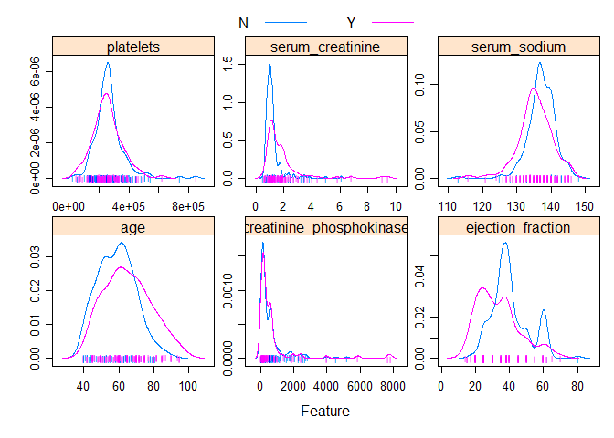
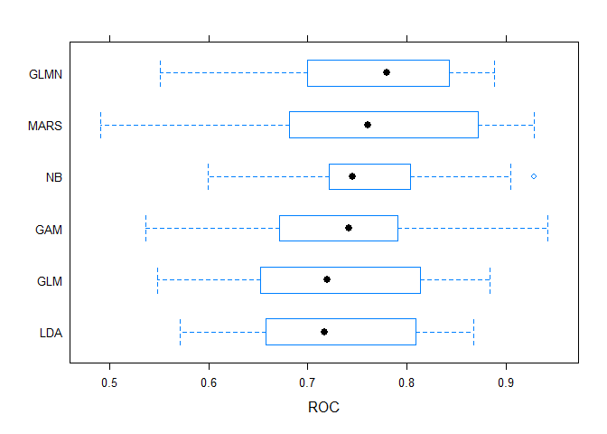
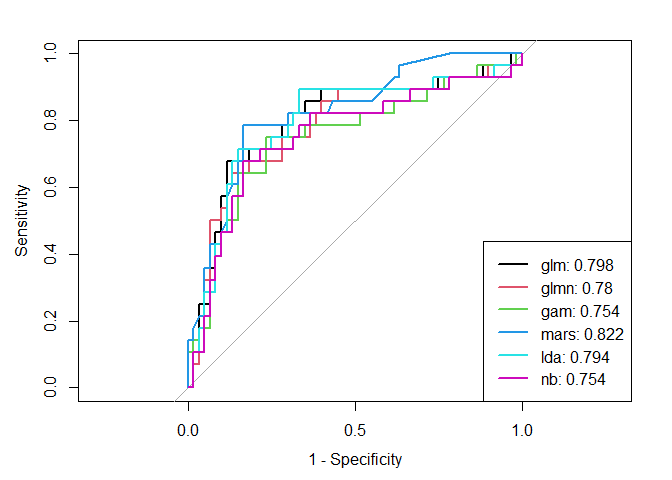
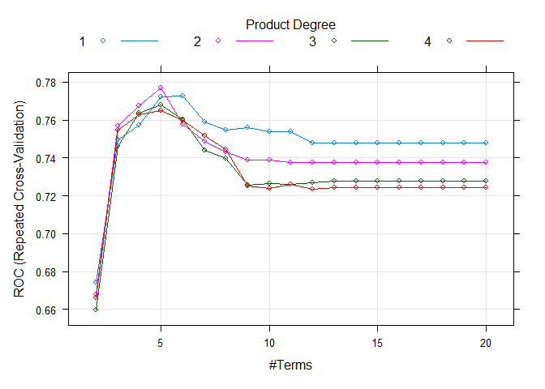
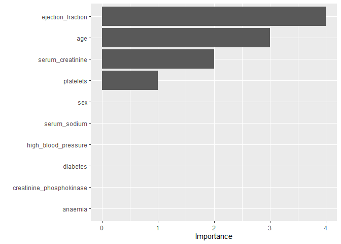

# Introduction
Heart failure is a common form of cardiovascular disease, which is a severe threat to patient's life. It occurs when the heart muscle doesn't pump blood as well as it should. Our research aims predict the death probability among heart failure patients with machine learning models on clinical features.

# Data
The dataset we analyzed contains the medical records of 299 heart failure patients collected at the Faisalabad Institute of Cardiology and at the Allied Hospital in Faisalabad (Punjab, Pakistan), during April–December 2015. It is a prospective cohort study. The patients consisted of 105 women and 194 men, and their ages range between 40 and 95 years old. There are 11 features of those patients, which further will become our predictors.

# Exploratory Analysis
## Continuous variables
Among all the continuous predictors, we can see that death events grouped when the follow-up-period is short(time < 50), patients with higher level of serum sodium tended to have death event, and patients with lower ejection fraction tended to have death event.(Figure 1)
## Binary variables
Among the binary predictors, the risk ratio of high blood pressure and anaemia are 1.42 and 1.33, which means the risk of death among heart failure patients with hypertension is 1.42 times the risk of death among heart failure patients without hypertension, and the risk of death among heart failure patients with anaemia is 1.33 times the risk of death among heart failure patients without anaemia.(Table 1)

# Models
In order to decide whether a patient with heart failure would die in following period, we use classification models to see what kinds of features correspond to the death event.

## Predictors
There are 12 predictors included in our models, consisting of 7 continuous predictors and 5 binary predictors. Specifically, 
age of the patient (age), if decrease of red blood cells or hemoglobin (anaemia), if the patient has hypertension (high_blood_pressure), level of the CPK enzyme in the blood (creatinine_phosphokinase), if the patient has diabetes (diabete), percentage of blood leaving the heart at each contraction (ejection_fraction), platelets in the blood (platelets), woman or man (sex), level of serum creatinine in the blood (serum_creatinine), level of serum sodium in the blood (serum_sodium), if the patient smokes or not (smoking), follow-up period (time), if the patient deceased during the follow-up period (death_event).

## Cross Validation setting
We used 5-fold cross validation to select the best tuning parameters for some of the models. The full dataset was splitted into 70% training set and 30% testing set, then training set was used to do a 5 repeats 5 folds cross validation with 75% training data and 25% validation data.

## Model Selection
Cross Validation results(Figure 2) and test performance(Figure 3)(Table 2) were shown in Appendix.

### Logistic Regression
$$log(\frac{\pi_i}{1-\pi_i}) = \beta_0 + \beta_1x_1 + \beta_2x_2 + \cdots + \beta_px_p\quad p=11$$
Firstly, we used logistic regression as our basis. However, as the assumption requires a linear relationship between log odds and the predictors, the bias was larger. There was no tuning parameters. Training performance was not very good with low ROC 0.72 and test performance was fine with 0.80 accuracy and 0.80 AUC. (Figure 3)

### Penalized Logistic Regression
With penalization term, the model contain less predictors. Only 4 predictors were kept in the model, which were age, ejection_fraction, serum_creatinine and serum_sodium. Best Tuning parameter for elastic model was alpha 0.05, and the best tuning parameter for penalization term was lambda 0.857. Generalizability of this model increased a little bit as the AUC score increased to 0.885.(Figure 3) However, The linear assumption was still a limitation.

### GAM
GAM model solved the limitation that the relationship between log odds and predictors must be linear, so we could see there were different degrees for those predictors which indicated the relationship could be curved. However, the cross validation result of GAM was still not that good with median ROC 0.74.(Figure 2) The limitation of GAM was due to its assumption on the independence of predictors. Thus, we performed MARS as following.

### MARS
MARS model dealt with both the interaction of predictors and the power of predictors. At the meantime, MARS could also do pruning to cut down unimportant terms and improve the generalizability. Therefore, we got a MARS model with 5 nprune and 2 degree (Figure 4), and the hinge function included age, ejection_fraction, serum_creatinine and the interaction between age and platelets. The training performance of MARS was second among all the models with median ROC 0.76 and the generalizabiliy was also good with 75% accuracy from confusion matrix and highest test AUC 0.822(Figure 2).

The models above were based on logistic regression, and we also performed models without logistic basis.

### LDA
LDA solved the limitation that when the class was well-separated, the parameter estimates for the logistic regression model might be unstable. But the LDA replied a little bit more on the normality of the distribution of X in each class. Because our data was skewed (Figure 1) and the class was two, the function of lowering dimension did not perform well in our project. The trainging performance ranked the bottom of all models(figure 2) and the test performance was not bad with 0.78 accuracy(Table 2) and 0.79 AUC, ranking third among all models.(Figure 3)

### Naive Bayes
Naive Bayes also assumed independence among features in each class. It performed better when the number of predictors were very large because it avoided the calculation of the inverse of covariance matrix. However, the MARS model told us that there existed interaction between predictors, so the assumption of Naive Bayes was impaired. Nevertheless, the training performance of Naive Bayed was fairly good, with median ROC 0.75 and the test performance was pretty good with accuracy 0.80 (Table 2).

### Summary
With the combination consideration of training performance, generalizabiliy and practical use, we chose MARS model as our final model to predict death_event among patients with heart failure. Firstly, as for the training performance, glmn and mars models outperformed other models on ROC. Then, to test performance, we set threshold to 0.4 because we wanted high specificity and we did not want to miss any possibility of death_event even if it cost more resources to follow a larger number of patients. The test AUC of Mars was highest. And the specificity of MARS was far better than glmn.(Table 2)

# Conclusions
The predictors in hinge function were ejection_fraction, age, serum_creatinie, and interaction between age and platelets.(Figure 5) The relatively important predictors were ejection_fraction and age, which corresponded to our exploratory analysis.(Figure 1) The coefficient of hinge(age - 67) is positive 0.147, indicating that higher age patients have higher death_event probability. The coefficient of hinge(35 - ejection_fraction) is positive 0.187, indicating that within 35%, patients with higher percentage of blood leaving the heart at each contraction have lower probability to have death_event. The coefficient of h(1.9-serum_creatinine) is negative -1.657, indicating that people with higher level of serum creatinine in the blood had higher probability of death event. All the conclusions matched perfectly with our exploratory analysis.(Figure 1) Further study could focus on deep diving the casaulity between those predictors and death event and improving the related status of heart failure patients.

\newpage
# Appendix

Figure 1. The density of death_event on different continuous predictors
```{r, echo=FALSE, out.width="80%"}

```

Figure 2. Cross Validation performance
```{r, echo=FALSE, out.width="80%"}

```
\newpage
Figure 3. Test performance AUC
```{r, echo=FALSE, out.width="80%"}

```

Figure 4. Best tuning parameter in MARS
```{r, echo=FALSE, out.width="80%"}

```
\newpage
Figure 5. Predictors importance in MARS
```{r, echo=FALSE, out.width="80%"}

```

Table 1. The risk ratio of different exposures
```{r, echo=FALSE, out.width="80%"}
knitr::include_graphics("midterm_files/figure-gfm/table1.png")
```

Table 2. The test accuracy from confusion matrix
```{r, echo=FALSE, out.width="80%"}
knitr::include_graphics("midterm_files/figure-gfm/table2.png")
```

